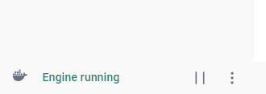

# write-a-sql-query
The official GitHub repository of the "Write a SQL Query" YouTube channel.

https://www.youtube.com/@WriteaSQLQuery

## Local set up instructions
If you would like to follow along with the Write a SQL Query videos using the same
local set up that I used during filming, follow the instructions below. My set up
is relatively simple: I run queries using DBeaver, connected to a local Docker container
running the base/default PostgreSQL image.

### 1. Install Docker
Go to https://docs.docker.com/get-started/get-docker/ and follow the instructions
for installing the personal/free version of Docker Desktop for your operating system.
 Once Docker Desktop is installed, make sure the Docker engine is running successfully on your machine (you can verify this in the Docker Desktop app by looking in the bottom-left corner, as pictured below)

 

### 2. Set up PostgreSQL Docker container
Open up a terminal window and run the following commands:

```
docker pull postgres
docker run --name write-a-sql-query-db -e POSTGRES_PASSWORD=default -p 5432:5432 -d postgres
```

These commands pull down the latest `postgres` Docker image and spin up a container called `write-a-sql-query-db`, serving a connection to a brand new PostgreSQL server
on localhost port 5432. The admin password to the PostgreSQL instance is set as `default`, but feel free to change this if desired. You will need this password to
connect to the PostgreSQL server in step 3 below.

> [!IMPORTANT]
> You only need to run the `docker run` command above *once* to create the container.
> After creating the `write-a-sql-query-db` container, you can start/stop it using
> the commands `docker start write-a-sql-query-db` and `docker stop write-a-sql-query-db`,
> respectively. You can also start/stop your container from the Docker Desktop GUI app.

### 3. Install and set up DBeaver
Go to https://dbeaver.io/ and download the free/open source version of DBeaver for your operating system. Once installed, set up a new database connection to a
PostgreSQL database. The Connection Settings modal's default values (including Host,
Database, Port, etc) should all be correct as-is; the only setting you will need to
edit is the Password. Enter the same value here that you passed to the
`POSTGRES_PASSWORD` config variable in the `docker run` command above, and check
the "Save password" checkbox if you want to avoid re-entering the password each time
you connect.

### 4. Write a SQL query!
Once you have PostgreSQL running on your machine, and
you have connected DBeaver to it, you are all set! From here, you can clone
this repo and/or copy code from the various `...problem.sql` files into a
DBeaver query window, and get querying!

